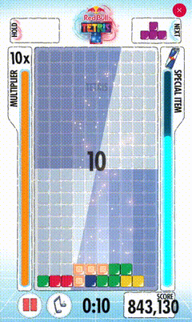

# RedBull-Tetris-AI

An AI agent that plays [Red Bull Tetris](https://www.redbull.com/us-en/events/red-bull-tetris-united-states) using Deep Q-Learning.

Currently, it can consistently achieve scores of 800K, with a personal best of 900K.

To avoid abuse, the trained model weights including the block recognizer and the DQN agent will not be publicly available for the time being.

However, you can still train your own model using the provided code.

---

TODO: Add documentation.
